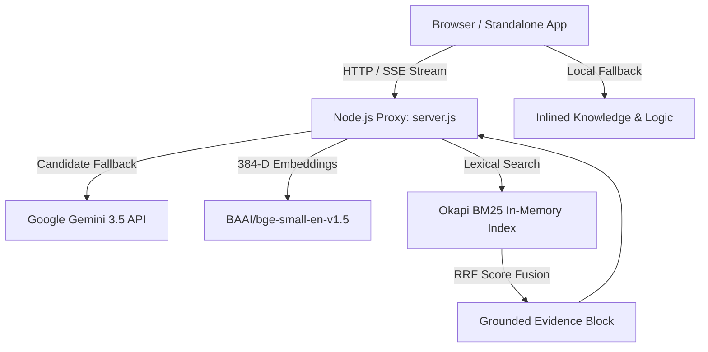

# 🇮🇳 MANAK-AI / BIS Trust Copilot — Master AI Architecture & Knowledge Blueprint

> **Notice for Any AI Reading This Document:**  
> This document is specifically structured to provide immediate, comprehensive context on the architecture, business logic, legal statutory grounding, data structures, and runtime mechanics of **MANAK-AI (BIS Trust Copilot)**, developed for **Smart India Hackathon 2026 (Problem Statement SIH26107: Ministry of Consumer Affairs, Food & Public Distribution / Bureau of Indian Standards)**.

---

## 1. Executive Summary & Objective

**MANAK-AI (BIS Trust Copilot)** is an evidence-grounded AI copilot and compliance engine built for Indian Standards, certification, and consumer product safety under the **Bureau of Indian Standards (BIS Act, 2016)**.

### Core Problem Solved:
1. **Consumer Protection:** Prevents counterfeit ISI marks, fake 6-digit laser HUID gold hallmarking, and unscrupulous unbranded e-commerce purchases. Computes statutory 3X compensation under Rule 49.
2. **MSME Compliance:** Helps Indian manufacturers navigate Scheme-I ISI licensing, Scheme of Testing & Inspection (STI) readiness, and laboratory testing mandates under Gazette Quality Control Orders (QCOs).
3. **Statutory Hallucination Prevention:** Prevents LLM hallucinations on national standards by grounding all generation in a hybrid dense-lexical vector retrieval pipeline (384-D BGE embeddings + Okapi BM25) across 23,401 Indian Standards and 769 mandatory QCOs.

---

## 2. Directory Structure of `out/`

```text
out/
├── README_FOR_AI.md                 <- [YOU ARE HERE] Complete technical & architecture dossier
├── standalone_app.html              <- 100% self-contained single-file app (opens in any browser, zero build step)
├── server.js                        <- Security-hardened Node.js backend proxy & RAG server
├── package.json                     <- Server dependencies (express, cors, @xenova/transformers)
├── .env.example                     <- Environment template (PORT, GEMINI_API_KEY)
├── modules/
│   ├── verification_engine.js       <- Standalone verification (CM/L, HUID, 3X compensation, Desi resolver, Bill auditor)
│   └── rag_hybrid_engine.js         <- Standalone Okapi BM25 + dense cosine similarity + RRF fusion
└── data/
    ├── provenance_manifest.json     <- Authority, cryptographic hashing, and data provenance
    ├── conformity_schemes.json      <- BIS Conformity Assessment Schemes (I, II, IV, X, Gazette)
    ├── sample_standards.json        <- Verified core standards (IS 4151, IS 1417, IS 14543, IS 1786, IS 694)
    └── sample_verified_licenses.json<- Ground-truth active/counterfeit CM/L numbers and gold HUIDs
```

---

## 3. System Architecture & Tech Stack



### Technology Highlights:
* **Frontend:** Vanilla HTML5, CSS3 Custom Properties ($100M SaaS Dark Theme), Vanilla ES6 JavaScript. Zero external bundler (no Webpack, Vite, or Tailwind dependency required).
* **Backend:** Node.js Express server. Acts as a secure intermediary proxy for Google Gemini LLM, keeping API keys safe on the server.
* **Security Layer:** Content Security Policy (CSP), strictly enforced localhost CORS, path traversal defense, in-memory sliding-window rate limiting.
* **AI Model Pipeline:** Google Gemini 3.5 Flash Lite (ultra-low latency) and Gemini 3.5 Flash, with automated graceful multi-candidate fallback on HTTP 429 quota limits.

---

## 4. Key Business Logic & Legal Formulas

### A. Statutory 3X Gold Under-Caratage Compensation Formula
* **Statutory Authority:** Rule 49 of *Bureau of Indian Standards (Hallmarking) Regulations, 2018* and Section 19 of *BIS Act, 2016*.
* **Formula:**
  $$\text{Purity Shortfall} = \text{Billed Fineness Ratio} - \text{Assayed Fineness Ratio}$$
  $$\text{Base Deficit} = \text{Purity Shortfall} \times \text{Weight (grams)} \times \text{Gold Market Rate (₹/g)}$$
  $$\text{Total Statutory Refund} = (\text{Base Deficit} \times 3.0) + \text{Testing Fee (₹45)}$$
* **Fineness Table:**
  * 24K: 0.999 (99.9%)
  * 22K: 0.916 (91.6%)
  * 18K: 0.750 (75.0%)
  * 14K: 0.585 (58.5%)

### B. Pakka Legal Bill Auditor
* Evaluates gold / jewellery sales invoices for anti-tax-evasion & hallmarking compliance:
  1. **Valid 6-character HUID:** 40 points (confirms legal hallmarked article)
  2. **Statutory 3% Gold GST Rate:** 30 points (catches illegal 5% or 0% kaccha bills)
  3. **Valid 15-character GSTIN:** 30 points (confirms registered GST entity)
  * **Score ≥ 90%:** Pakka Legal Bill (Eligible for consumer court & BIS claim)
  * **Score < 90%:** Kaccha Bill / Non-Compliant

### C. Desi / Colloquial Term Resolution Matrix
Translates common everyday Hindi/Indian marketplace terms to authoritative Indian Standards:
* `"sariya"` $\rightarrow$ **IS 1786:2008** (High Strength Deformed Steel Bars / TMT Rebars)
* `"gas chulha"` $\rightarrow$ **IS 4246:2002** (Domestic Gas Stoves for LPG)
* `"geyser"` $\rightarrow$ **IS 2082:2018** (Stationary Storage Electric Water Heaters)
* `"tullu pump"` $\rightarrow$ **IS 9079:2018** (Monobloc Agricultural Electric Pumps)
* `"bijli ka taar"` $\rightarrow$ **IS 694:2010** (PVC Insulated Building Wires up to 1100V)
* `"khilona"` $\rightarrow$ **IS 9873 (Part 1):2019** (Safety of Toys)
* `"pani ki bottle"` $\rightarrow$ **IS 14543:2024** (Packaged Drinking Water)

### D. Reciprocal Rank Fusion (RRF)
Combines keyword search and semantic dense vector embeddings:
$$RRFScore(d) = \frac{1}{60 + Rank_{BM25}(d)} + \frac{1}{60 + Rank_{Dense}(d)}$$

---

## 5. API Reference (`server.js`)

| Endpoint | Method | Input Parameters | Output Description |
| :--- | :--- | :--- | :--- |
| `/api/chat` | POST | `{ messages: [], stream: true/false, role: "consumer"|"msme"|"inspector" }` | Real-time Server-Sent Events (SSE) or JSON completion from Gemini 3.5 |
| `/api/rag` | POST | `{ query: "...", topK: 8, role: "consumer" }` | Top-K hybrid chunks scored via Okapi BM25 + dense cosine vectors |
| `/api/embed` | POST | `{ text: "..." }` | 384-dimensional normalized float array from local BGE-small transformer |
| `/api/translate` | POST | `{ text: "...", sourceLang: "en", targetLang: "hi" }` | Accurate neural translation preserving technical IS codes and numerals |
| `/api/standards/resolve` | POST | `{ code: "IS 4151" }` | Standard canonical metadata, division, year, and mandatory QCO status |
| `/api/health` | GET | `None` | Health status of server, transformer engine, and vector database count |
| `/api/stats` | GET | `None` | Count of indexed standards (23,401) and dense RAG chunks (1,975) |

---

## 6. How to Run the System

### Option 1: Standalone Single File (Zero Setup)
Simply open `out/standalone_app.html` directly in any web browser:
```bash
# Windows
Start-Process "out/standalone_app.html"

# Linux / Mac
open out/standalone_app.html
```
The standalone app contains inlined CSS, bundled verification logic, local database registries, and client-side fallback.

### Option 2: Full Server & Backend Pipeline
1. Install dependencies:
   ```bash
   cd out
   npm install
   ```
2. Configure `.env`:
   ```bash
   cp .env.example .env
   # Add your GEMINI_API_KEY
   ```
3. Start the server:
   ```bash
   node server.js
   ```
4. Access the web interface at `http://localhost:3000/chat.html` or `http://localhost:3000/standalone_app.html`.

---

## 7. Guidelines for Collaborating AI Models
1. **Keep Responses Natural:** Avoid rigid robotic refusal sentences when users engage in casual chat ("hi", "hello", "namaste").
2. **Preserve Exact Numerals:** When referencing Indian Standards, always keep codes like `IS 4151`, `IS 1417`, `IS 14543`, `IS 1786` intact without modification.
3. **Respect Verification Engine:** Use `modules/verification_engine.js` as the authoritative source for CM/L, HUID, and 3X compensation calculations.
